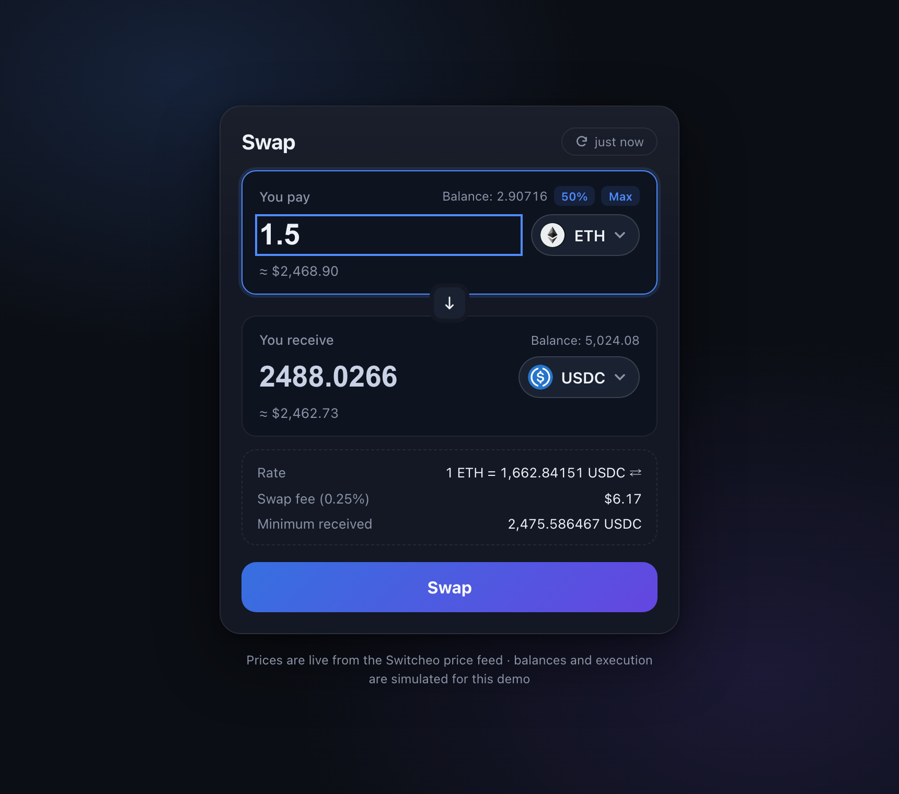
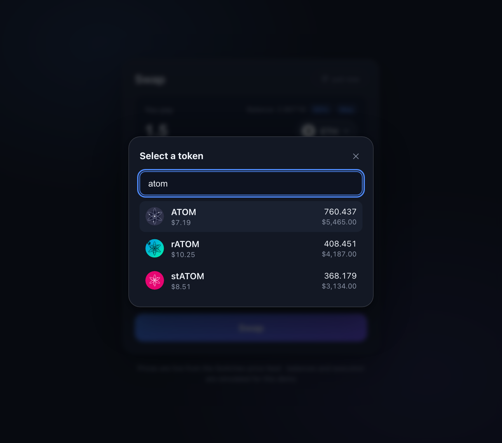
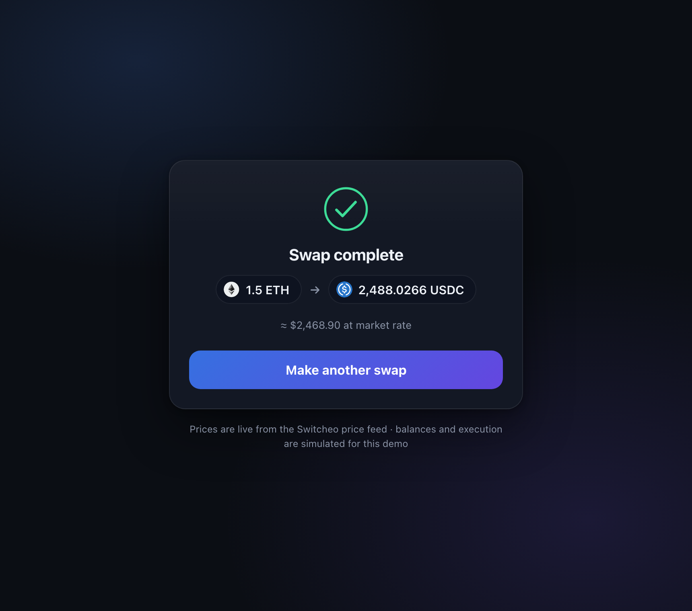

# Problem 2 — Currency Swap

A production-minded token swap form. **React 18 + TypeScript (strict) + Vite**, zero runtime dependencies beyond React — every component, style and interaction is hand-built.

**Live demo: https://99tech-code-challenge-fe.vercel.app**



| Token picker (search + keyboard nav) | Success receipt |
|---|---|
|  |  |

## Run it

```bash
npm install
npm run dev      # http://localhost:5173
npm run build    # type-checks (tsc -b) then bundles
npm run e2e      # Playwright end-to-end suite (boots the dev server itself)
```

## Assumptions (declared per the challenge instructions)

- **No backend exists**, so execution is simulated (1.4s delay → success receipt), balances are deterministic mocks, and the 0.25% fee / 0.5% slippage are illustrative venue parameters a quote API would normally supply.
- **The price feed is a static snapshot** (dated 2023-08-29). The app still treats it as live — refetching every 60s and showing "updated Xs ago" — because that's the behavior a real feed needs.
- **Tokens without a usable price are omitted** from the picker, as the task explicitly allows.
- **Dark theme only** — the deliberate convention for DEX interfaces (Uniswap, Binance, Switcheo's own products); all colors live in CSS custom properties so a light theme is one `@media` block away.

## What it does

- **Live prices** from `interview.switcheo.com/prices.json`, deduplicated to the latest positive quote per token (the feed contains duplicate rows, e.g. BUSD twice), auto-refreshed every 60s with a manual refresh button showing "updated Xs ago".
- **Bi-directional quoting** — type in *either* field; the other side is derived from the live rate. The derived side is visually dimmed so you always know which number you authored.
- **Token picker modal** with search (prefix matches ranked first), popular-token shortcuts, per-token price + demo balance, full **keyboard navigation** (↑/↓/Enter/Escape), and click-outside to dismiss.
- **Wallet ergonomics** — demo balances with **Max / 50%** quick-fill, live USD equivalents under both fields.
- **Transparent pricing** — rate line (tap to invert direction), swap fee (0.25%), and minimum received after slippage tolerance (0.5%). In a real DEX these are the three numbers users actually check before committing.
- **Validation that guides, not scolds** — the submit button states *why* it's disabled ("Enter an amount", "Insufficient ETH balance") instead of a dead grey button; the insufficient-balance error suggests using Max.
- **Simulated execution** (per the task hint): loading spinner → animated success receipt with both legs of the trade → "make another swap".
- **All four network states designed**: skeleton shimmer while loading, error card with retry, stale-price tolerance (a failed background refresh keeps the last good prices instead of blanking the form), and success.

## Details I'd flag in a real code review

**The price feed and the icon repo disagree on symbol casing.** The feed says `STATOM` / `RATOM` / `STEVMOS`…, but the icons (and the tokens' own branding) are `stATOM` / `rATOM` / `stEVMOS` — and GitHub raw URLs are case-sensitive, so the naive icon URL 404s for five tokens. The app normalizes these (`src/lib/tokens.ts`), displays the branded casing, and still falls back to a two-letter monogram if any icon is missing. *This is the kind of data-quality mismatch worth reporting upstream rather than silently patching.*

**Amount inputs are strings, not numbers.** Intermediate states like `0.` or `.5` are valid while typing; parsing to `number` too early destroys them. Input is sanitized (one decimal point, digits only, commas from locale-formatted pastes normalized) rather than blocked, so paste works.

**Selecting the counterpart token flips the pair** instead of erroring — matching what users of Uniswap-class UIs expect, and making an invalid state (ETH → ETH) unrepresentable rather than validated against.

**Deterministic mock balances** — hashed from the symbol and scaled by price into a plausible $800–$5,800 range, so Max/50% behave consistently across reloads and the demo looks like a real portfolio.

**Accessibility**: labelled inputs, `role="dialog"`/`aria-modal`, `role="alert"` on errors, `aria-live` on the quote details, visible `:focus-visible` rings, `prefers-reduced-motion` support, `inputMode="decimal"` for mobile keyboards.

## Structure

```
src/
  lib/tokens.ts        # feed fetch, dedupe, icon URL normalization, mock balances
  lib/format.ts        # input sanitizing, token/USD/relative-time formatting
  hooks/useTokenPrices.ts  # load + 60s background refresh + stale tolerance
  components/
    SwapCard.tsx       # state machine: idle → submitting → success (+ loading/error)
    TokenField.tsx     # one side of the swap (input, token button, balance, USD)
    TokenSelectModal.tsx # search, keyboard nav, popular chips
    TokenIcon.tsx      # icon with monogram fallback
```

## What I'd do next (with a backend)

1. **Real quoting** — debounced quote API with route/price-impact, quote expiry countdown, re-quote on refresh.
2. **Slippage settings** — user-configurable tolerance with a warning band for high-impact trades.
3. **Wallet connection** — real balances, allowance/approval step, transaction status toasts with explorer links.
4. **Unit tests** — the pure logic (`normalizePrices`, `sanitizeAmountInput`, rate math) is already isolated in `lib/` specifically so it can be unit-tested without rendering; add Vitest for those. End-to-end coverage already exists: `npm run e2e` runs 8 Playwright tests (quote math vs the displayed rate, bi-directional editing, keyboard-driven token search, pair flipping, submit → success, insufficient balance, input sanitizing, and a mobile-overflow regression check).
